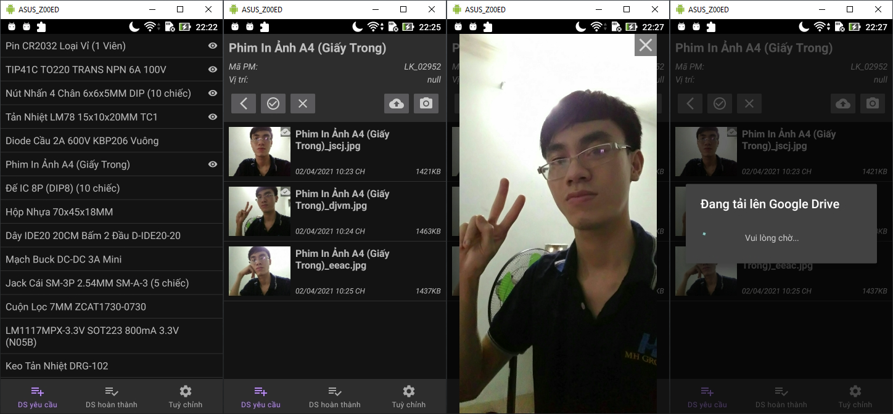
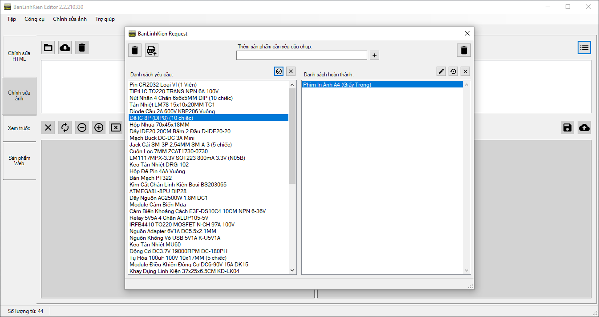
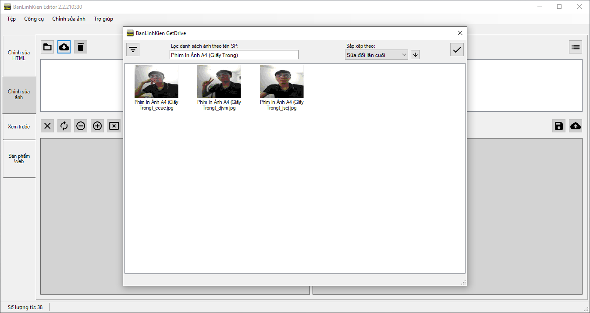
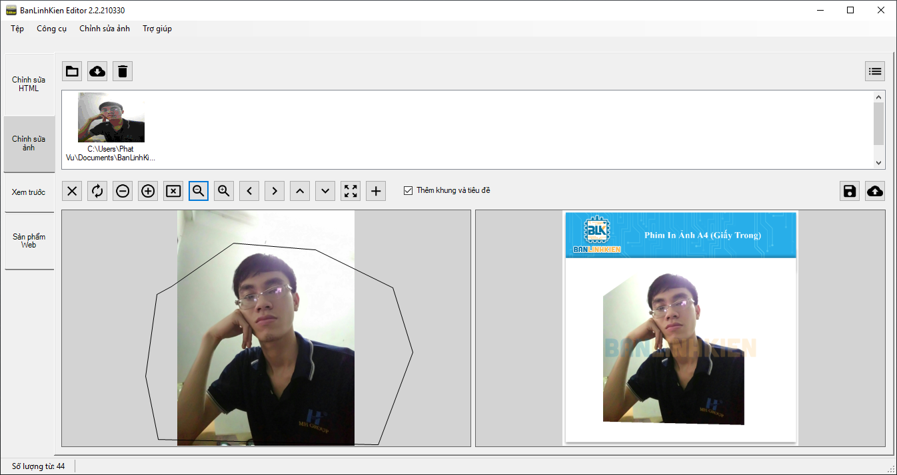

# Ứng dụng BanLinhKien Capture
*Ứng dụng BanLinhKien Capture được viết bằng ngôn ngữ Java trên Android Studio*

### Giới thiệu
BanLinhKien Capture là phần mềm hỗ trợ chụp ảnh sản phẩm và đẩy trực tiếp ảnh lên Drive giúp BanLinhKien Editor nhanh chóng lấy ảnh để chỉnh sửa.

### Tính năng
- Nhận yêu cầu tức thời từ BanLinhKien Request thông qua giao thức giao thức MQTT

- Ảnh được chụp sẽ được đẩy lên Drive và được lấy dễ dàng thông qua BanLinhKien GetDrive

- Hỗ trợ phiên bản Android từ 4.4 (API 19) trở lên
- Giao diện thân thiện dễ dàng sử dụng

